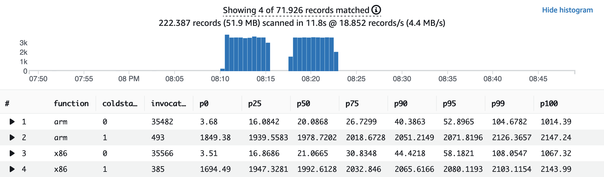

# AWS Lambda function with JRE-17 based layer
An AWS Lambda function based on a generic JRE-17 layer, which includes all Java modules.


## Getting started

Download or clone the repository.

Install prerequisite software:

1. Install [AWS CDK](https://docs.aws.amazon.com/cdk/latest/guide/getting_started.html)
2. Install [Docker](https://docs.docker.com/get-docker/)

3. Build the JRE-17 AWS Lambda layer using Docker:

```bash
./build-jre-17-layer.sh
```

4. Build the function and provision the AWS infrastructure (mainly Amazon API Gateway, AWS Lambda and Amazon DynamoDB) using AWS CDK:

```bash
./provision-function.sh
```

The API Gateway endpoint URL is displayed in the output and saved in the file `example/infrastructure/target/outputs.json`. The contents are similar to:

```
{
  "InfrastructureJRE17LayerStack": {
    "apiendpoint": "https://<API_ID>.execute-api.<AWS_REGION>.amazonaws.com"
  }
}
```


## Using Artillery to load test the changes

First, install prerequisites:

1. Install [jq](https://stedolan.github.io/jq/) and [Artillery Core](https://artillery.io/docs/guides/getting-started/installing-artillery.html)
2. Run the following two scripts from the projects root directory:

```bash
artillery run -t $(cat example/infrastructure/target/outputs.json | jq -r '.InfrastructureJRE17LayerStack.apiendpoint') -v '{ "url": "/x86" }' example/infrastructure/loadtest.yml
artillery run -t $(cat example/infrastructure/target/outputs.json | jq -r '.InfrastructureJRE17LayerStack.apiendpoint') -v '{ "url": "/arm" }' example/infrastructure/loadtest.yml
```


### Check results in Amazon CloudWatch Insights

1. Navigate to Amazon **[CloudWatch Logs Insights](https://console.aws.amazon.com/cloudwatch/home?#logsV2:logs-insights)**.
   2.Select the log groups `/aws/lambda/jre-17-function-arm` and `/aws/lambda/jre-17-function-x86` from the drop-down list
3. Copy the following query and choose **Run query**:

```
filter @type = "REPORT"
| parse @log /\d+:\/aws\/lambda\/jre-17-function-(?<function>.+)/
| stats
count(*) as invocations,
pct(@duration, 0) as p0,
pct(@duration, 25) as p25,
pct(@duration, 50) as p50,
pct(@duration, 75) as p75,
pct(@duration, 90) as p90,
pct(@duration, 95) as p95,
pct(@duration, 99) as p99,
pct(@duration, 100) as p100
group by function, ispresent(@initDuration) as coldstart
| sort by function, coldstart
```

You see results similar to:



## Security

See [CONTRIBUTING](CONTRIBUTING.md#security-issue-notifications) for more information.

## License

This library is licensed under the MIT-0 License. See the LICENSE file.
